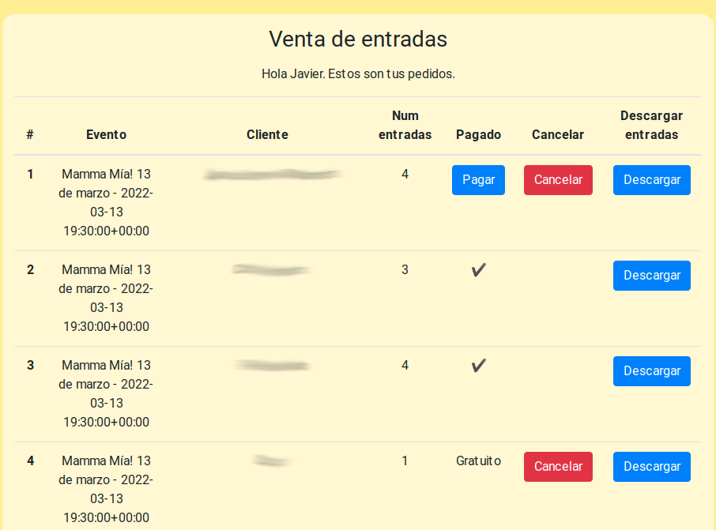

# ticket-pos
System for selling and checking theatre tickets. With seats reservation included.

## Features
- Ticket generation.
- Live seat reservation.
- Multiple Points of Sale.
- Ability to prepay or just book tickets.
- USB barcode scanner support for box office, check-in and accomodation.
- Seat map on accomodation.

## TODO
- Email support for sending tickets.
- Multiple ticket templates.
- CSS tweaks for mobile browsers.
- Rework permissions.

## Screenshots (in spanish)

POS Home. Active events selection

Seat selection with live changes for multiple POS

POS orders list, with ability to download tickets or mark as paid.

If customers scan their ticket they can see their booked seats.

## Installation
- Clone this repo
- `cd tickets`
- Create a Python virtualenv
- Install requirements `pip install -r requirements.txt`
- Run Redis image for live seat map (required) `docker run -p 6379:6379 -d redis:5 `
- Change hostnames in `tickets/pos/ticket_creator.py:24`, `tickets/tickets/settings.py:28 and 145` and `tickets/pos/templates/activate_tickets.html:102`
- Create migrations and superuser as usual in Django 
`python manage.py makemigrations` `python manage.py migrate` `python manage.py createsuperuser`
- Run locally with `python manage.py runserver`

For production use change settings to a "real" SQL server (MariaDB or PostgreSQL) and follow instructions on how to deploy with supervisord from [Django channels docs](https://channels.readthedocs.io/en/stable/deploying.html)

## Disclaimer
This project was made by [@jscoba](github.com/jscoba) for CM Isabel la Católica of University of Granada and is provided as-is. Feel free to fork or open an issue if you want to contribute or ask something.